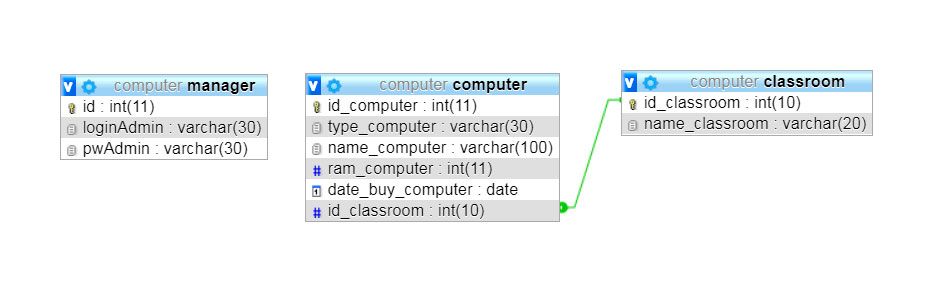

#  Department of computer science

- Application PHP CRUD
- Foundation Framework
- MVC Architecture
- PDO (MySQL Connect)
- SQL Joins

# Conception

# Configuration

1. Extract the files 
2. Create a database & import the database file "db_computer.sql"
3. Configurate the file config.php
> ( example : define("DATABASE", "database_name"); define("BASE_URL","your_url"); )

